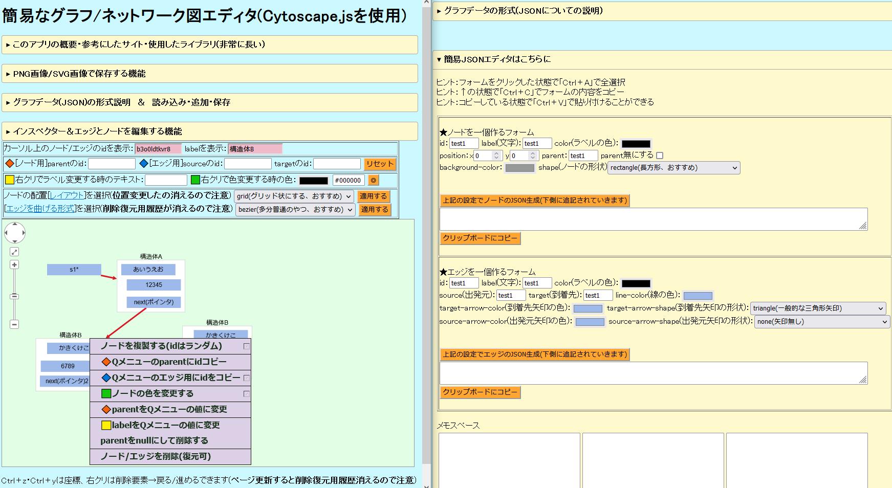

# ★エディタの概要 
・Cytoscape.jsを使用した簡易的なネットワーク図/グラフのエディタです。  
・説明図、相関図、ネットワーク図等の作成に使えると思います。  
・JSONからグラフを生成するので、応用しやすいと思います。  
・OSSの拡張機能をいっぱい使用しています。(動作が重いかも)  
・カラーリングと画面構成は適当です。下のような感じになっています。  
　※画像のリンク先で右クリックすると全体写ってる画像が見れます  

  
# エディタの機能
以下のような機能を全部入れました。(ほぼ拡張機能)  
・JSON(形式説明有り)を読み込みグラフを生成。  
　※読み込み時にケツカンマを自動削除します  
・作成済みグラフに新しい要素を追加。(JSONで)  
・作成したグラフのJSONを保存する(削る要素が選択可能)  
・インスペクターからノード/エッジのプロパティを確認  
・レイアウトやカーブスタイルをセレクトボックスから選択  
・コンテキストメニューからノード/エッジを追加  
・コンテキストメニューからノード/エッジを削除/復元  
・コンテキストメニューからノード/エッジのプロパティ変更  
・移動したノード/エッジの座標をundo/redo  
・ページを更新してもパン位置,ズーム倍率,グラフを維持  
・GUIを操作してJSONを生成する機能(詳細な説明付き)
  

# ★エディタを動作させる方法
・ファイルを右上の「Code＞Download ZIP」からダウンロードして、中にある  
「app_graph.html」と「app_json-edit.html」をブラウザで開くだけで使用可能です。  
・`html+JavaScript+css`しか使用していないので、ランタイム等は不要なはずです。  
・ライブラリを再配布する形式(MITとGPLなので可能)にしたのでオフラインでも使えます。  
・Firefoxでの動作確認済み。
  

# ★使用しているJavaScriptライブラリ、フォントのライセンス
ライセンス情報は以下のマークダウンにまとめて書きました。  

[USE_LIBRARY_LICENCE.md](https://github.com/yogurt1234/ez-network-graph-editor_Deluxe/blob/main/js-library/USE_LIBRARY_LICENCE.md)   

  

# ★このエディタのライセンス

使用ライブラリからのコピーレフトにより、   ライセンスは[GPLv3 ライセンス](https://ja.wikipedia.org/wiki/GNU_General_Public_License)です。
